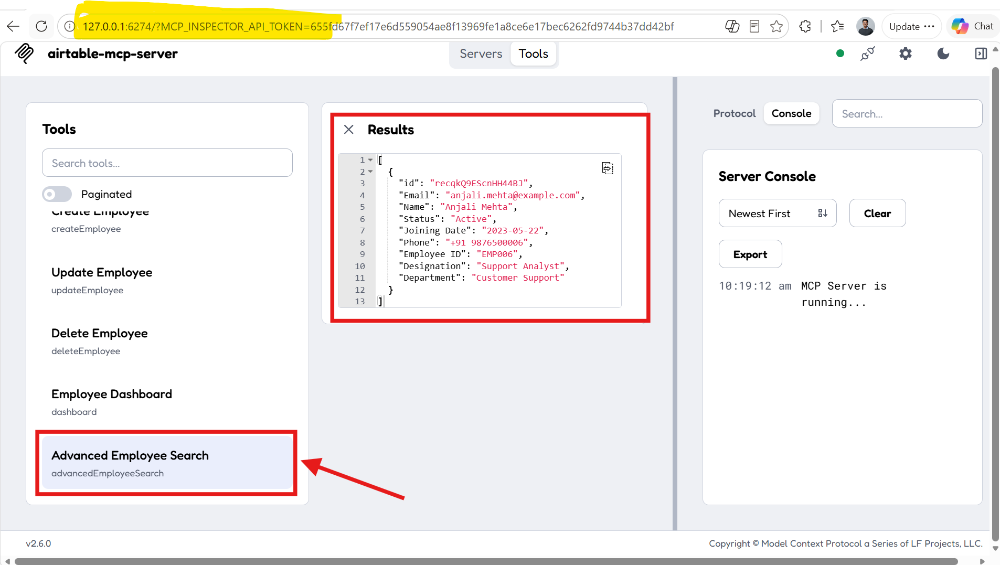
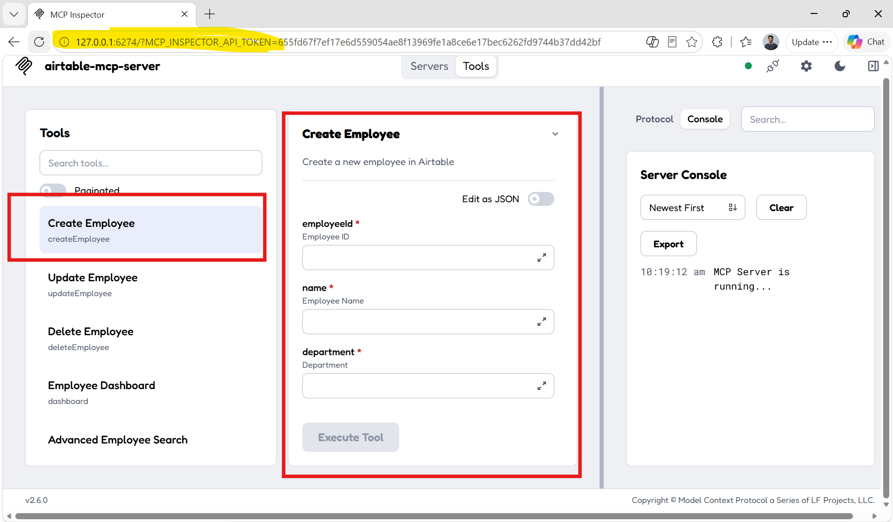
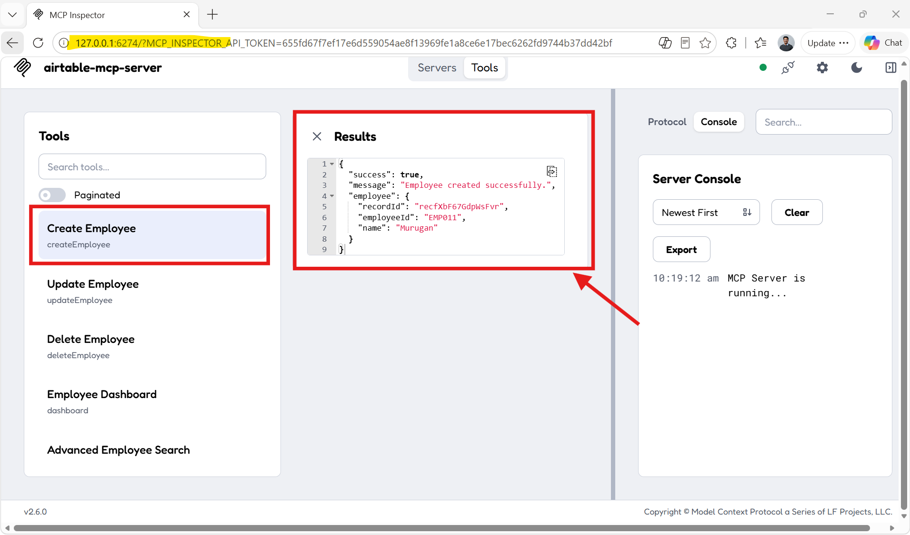
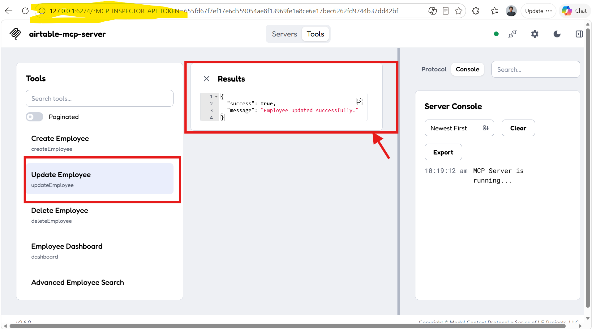
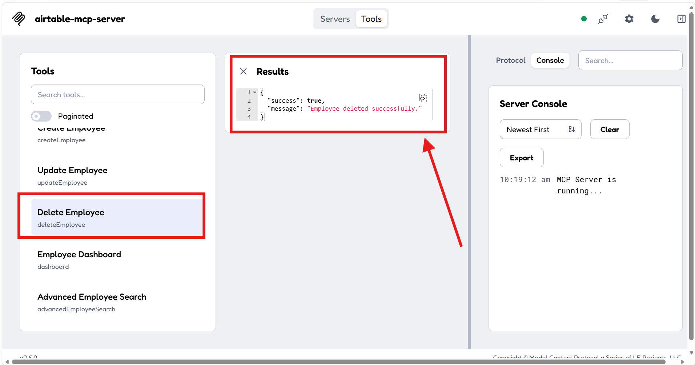

# Airtable MCP Server

A production-ready **Model Context Protocol (MCP) Server** built using **Node.js**, **Model Context Protocol (MCP SDK)**, and **Airtable**.

This project demonstrates how AI clients can securely interact with Airtable through MCP tools to manage employee data.

---

# Features

- Search Employee
- Advanced Employee Search
- Create Employee
- Update Employee
- Delete Employee
- Employee Dashboard
- Duplicate Employee ID Validation
- Duplicate Email Validation

---

# Tech Stack

- Node.js
- Model Context Protocol (MCP SDK)
- Airtable
- Zod
- Dotenv
- Git
- GitHub

---

# Project Structure

```text
airtable-mcp-server/

services/
tools/
screenshots/
docs/

server.js
package.json
package-lock.json
README.md
.env.example
```

---

# Architecture

> Add the architecture image after creating it.

```text
                     ChatGPT / Claude / MCP Inspector
                               │
                               ▼
                          MCP Client
                               │
                        STDIO Transport
                               │
                               ▼
                      Airtable MCP Server
                               │
       ┌───────────────────────┼────────────────────────┐
       │                       │                        │
 Search Employee         CRUD Operations         Dashboard Tool
                               │
                               ▼
                      Airtable Service Layer
                               │
                               ▼
                           Airtable
```

Later replace the above diagram with:

```markdown

```

---

# Available MCP Tools

| Tool | Description |
|------|-------------|
| Search Employee | Search employee by name |
| Advanced Employee Search | Search employees using different fields |
| Create Employee | Create a new employee |
| Update Employee | Update employee details |
| Delete Employee | Delete an employee |
| Employee Dashboard | View employee statistics |

---

# Installation

Clone the repository

```bash
git clone https://github.com/Pavansaigudla/airtable-mcp-server.git
```

Navigate to the project

```bash
cd airtable-mcp-server
```

Install dependencies

```bash
npm install
```

---

# Configuration

Create a `.env` file using `.env.example`

```env
AIRTABLE_TOKEN=your_personal_access_token
AIRTABLE_BASE_ID=your_base_id
AIRTABLE_TABLE_NAME=Employee information
```

---

# Run the MCP Server

```bash
npm start
```

---

# Testing with MCP Inspector

Start MCP Inspector

```bash
npx @modelcontextprotocol/inspector
```

Configure the connection

| Setting | Value |
|----------|-------|
| Transport | STDIO |
| Command | node |
| Arguments | server.js |
| Working Directory | Project Folder |

Execute the available MCP tools directly from the MCP Inspector.

---

# Screenshots

## Search Employee



---

## Create Employee



---

## Create Employee Response



---

## Update Employee



---

## Delete Employee



---

## Employee Dashboard


---

# Example Use Cases

### Search Employee

Search employee by name.

### Create Employee

Create a new employee record in Airtable.

### Update Employee

Update employee information.

### Delete Employee

Delete employee records.

### Dashboard

View employee statistics.

### Advanced Employee Search

Search employees using different fields like:

- Name
- Department
- Status
- Designation
- Employee ID

---

# Validation

This project validates:

- Duplicate Employee ID
- Duplicate Email Address
- Employee existence before Update
- Employee existence before Delete

---

# Learning Outcomes

This project helped me learn:

- Model Context Protocol (MCP)
- MCP Server Architecture
- MCP Tools
- MCP Inspector
- STDIO Transport
- Airtable API Integration
- CRUD Operations
- Dashboard APIs
- Advanced Search
- Input Validation
- Git & GitHub

---

# Future Enhancements

- Bulk Employee Import
- Bulk Employee Update
- Employee Reports
- Employee Analytics
- Dynamic Dropdown Values
- CSV Import
- CSV Export
- AI Powered Employee Assistant
- Integration with Airtable Official MCP

---

# Author

**Pavansai Gudla**

GitHub

https://github.com/Pavansaigudla

---

If you found this project useful, consider giving it a ⭐ on GitHub.